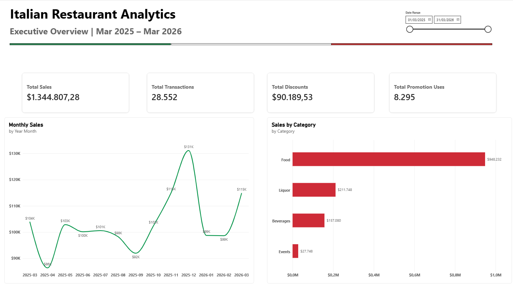
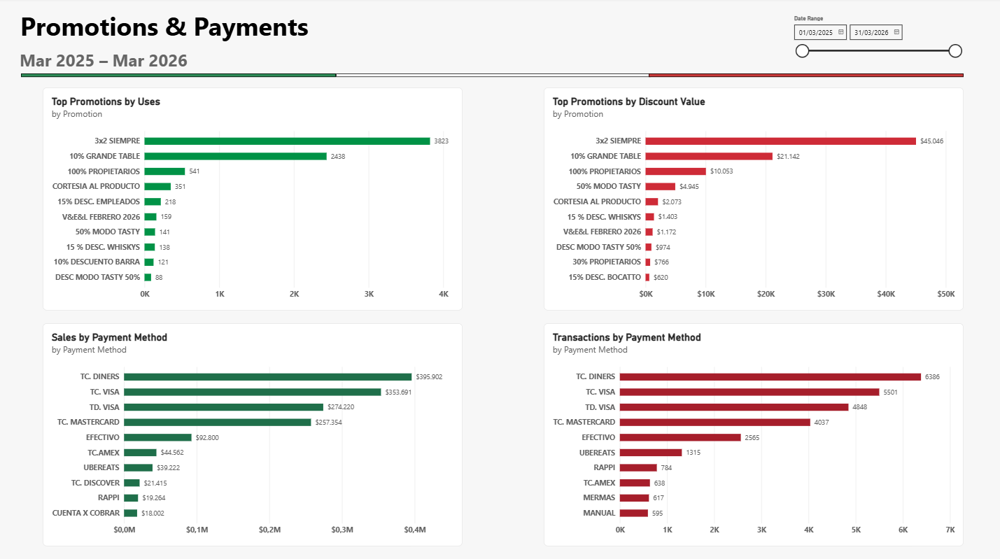
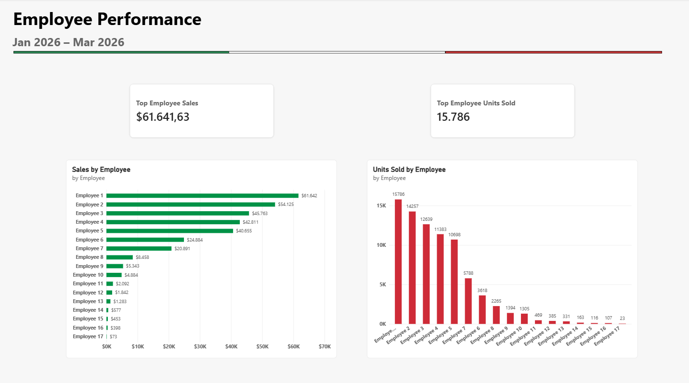
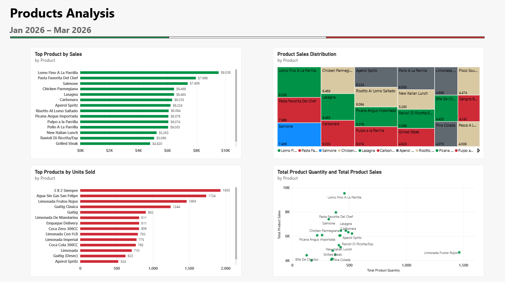
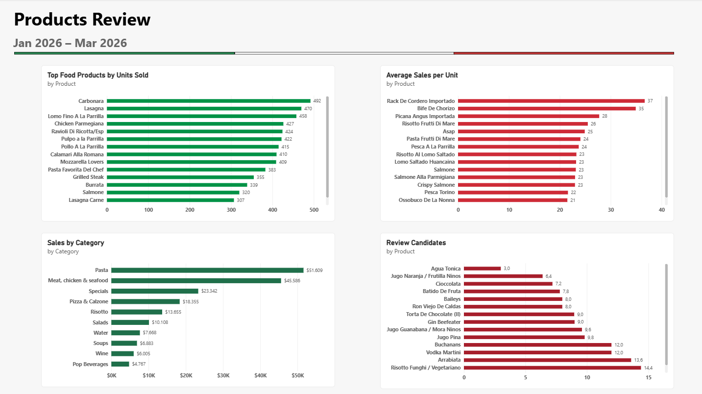

# Italian Restaurant Analytics

End-to-end restaurant sales analytics project using **Excel, Python, SQL, and Power BI**.

This portfolio project analyzes real-world sales data from an Italian restaurant business. The workflow covers the complete data analytics process, from raw data cleaning and transformation to exploratory analysis, SQL querying, business insights, and interactive dashboard development.

To protect business confidentiality, identifying information has been removed or anonymized.

---

## Project Overview

The objective of this project was to transform raw restaurant sales data into actionable business insights.

The analysis focuses on five main areas:

- Sales performance
- Promotions and discounts
- Payment methods
- Employee performance
- Product performance

The main sales dataset covers **March 2025 to March 2026**, while employee and product-level datasets cover **January to March 2026**.

The project follows an end-to-end analytics workflow:

**Raw Data → Data Cleaning → Exploratory Analysis → SQL Analysis → Power BI Dashboard → Business Insights**

---

## Tools & Technologies

- **Excel** — Original data source and initial inspection
- **Python** — Data cleaning, transformation, exploratory analysis, and visualization
- **Pandas** — Data manipulation and preparation
- **Matplotlib** — Data visualization
- **SQL / SQLite** — Database creation and business queries
- **Power BI** — Data modeling, DAX measures, and dashboard development
- **Jupyter Notebook** — Python analysis documentation
- **GitHub** — Project documentation and version control

---

## Data Preparation

The original Excel workbook contained multiple worksheets representing different business areas.

Using Python, each dataset was cleaned and transformed into analysis-ready files.

The cleaning process included:

- Removing blank rows and subtotal rows
- Standardizing column names and text values
- Cleaning employee and product names
- Converting numeric fields to appropriate formats
- Handling negative and inconsistent values
- Separating cleaned datasets by business area
- Anonymizing employee information for portfolio use

The cleaned datasets were then used for Python analysis, SQL queries, and Power BI reporting.

---

## Key Business Metrics

Across the main analysis period:

- **Total Sales:** $1,344,807.28
- **Total Transactions:** 28,552
- **Total Discounts:** $90,189.53
- **Promotion Uses:** 8,295

These metrics provide a high-level view of restaurant activity and serve as the foundation for deeper analysis.

---

## Product Analysis

The product analysis examined **342 unique products** during January–March 2026.

Key findings include:

- Product sales totaled approximately **$307K**
- A relatively small group of products generated most of the revenue
- **70 products (20.47% of the portfolio) generated approximately 80.16% of product sales**
- High sales volume did not always correspond to high revenue
- Premium products generated significantly higher average sales value per unit
- Low-performing products were identified as **review candidates**, rather than automatically recommended for removal

The analysis combined sales, quantity, revenue concentration, and average value per unit to provide a more complete view of menu performance.

---

## Power BI Dashboard

A five-page Power BI dashboard was developed to present the results of the analysis.

### Executive Overview



Provides a high-level summary of sales, transactions, discounts, promotions, monthly trends, and category performance.

### Promotions & Payments



Analyzes promotion usage, discount value, payment-method sales, and transaction volume.

### Employee Performance



Compares employee sales performance and units sold. Employee names were anonymized for confidentiality.

### Products Analysis



Explores top products by sales and quantity, product sales distribution, and the relationship between units sold and revenue.

### Product Review



Focuses on product categories, average sales value per unit, food-product performance, and low-performing products that may require further business review.

---

## SQL Analysis

The cleaned datasets were also loaded into a SQLite database.

SQL queries were created to analyze:

- Sales performance
- Promotions
- Payment methods
- Employees
- Products

The SQL scripts are available in the [`sql`](sql/) directory.

This stage demonstrates how the same business questions can be answered using relational database queries in addition to Python and Power BI.

---

## Python Analysis

Python notebooks document both the data-cleaning and analytical stages of the project.

The notebooks include:

- Sales data cleaning
- Promotions data cleaning
- Payment methods data cleaning
- Employee data cleaning
- Product data cleaning
- Sales analysis
- Promotions analysis
- Payment-method analysis
- Employee analysis
- Product analysis
- SQLite database creation
- SQL analysis reporting

The notebooks are available in the [`notebooks`](notebooks/) directory.

---

## Repository Structure

```text
italian-restaurant-analytics/
│
├── data/
│   ├── raw/
│   └── cleaned/
│
├── images/
│   ├── dashboard_overview.png
│   ├── promotions_payments.png
│   ├── employee_performance.png
│   ├── products_analysis.png
│   └── product_review.png
│
├── notebooks/
│
├── powerbi/
│   ├── italian_restaurant_analytics.pbix
│   └── italian_restaurant_analytics.pdf
│
├── report/
│
├── sql/
│
├── .gitignore
├── LICENSE
└── README.md
```

---

## Confidentiality

This project is based on real business data.

To protect the client:

- Employee names have been anonymized
- Identifying business information is not presented in the public portfolio
- The complete client-facing business report remains private
- Sensitive information is excluded from public documentation

The repository is intended to demonstrate the **analytical methodology, technical workflow, and dashboard development process** rather than disclose confidential business information.

---

## Skills Demonstrated

This project demonstrates practical experience in:

- Data cleaning and preparation
- Exploratory data analysis
- Business-oriented data analysis
- Data visualization
- SQL querying
- Database creation
- Power BI data modeling
- DAX measures
- Dashboard design
- KPI development
- Translating analytical results into business insights
- Data confidentiality and anonymization

---

## Author

**Guido Acosta**

Data Analytics Portfolio Project — 2026
